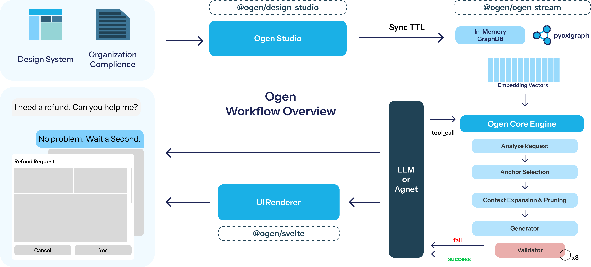

<p align="center">
  <h1 align="center">Ogen</h1>
  <p align="center"><b>Ontology-Based Generative UI Engine</b></p>
  <p align="center">
    A conversational system that generates UI through Knowledge Graph-based design system reasoning
  </p>
</p>

<p align="center">
  
  
  
  
  
</p>

---

## Overview

LLM-based UI generation suffers from **design system inconsistency** (hallucination) and **ignorance of inter-component relationships**.

**Ogen** addresses these problems by structuring design systems as RDF/OWL ontologies to build a **Knowledge Graph (KG)**, and generating UI through a KG-grounded multi-stage reasoning pipeline.

## System Architecture


## Key Features

| Feature | Description |
|---------|-------------|
| 🧠 **KG-Grounded Reasoning** | 4-stage pipeline generating UI grounded in a design system Knowledge Graph |
| 🎨 **Ontology-Based Design System** | Atomic Design (Atom/Molecule/Organism/Template) + RDF/TTL ontology |
| 💬 **Streaming Chat Interface** | SSE-based real-time streaming conversational UI generation |
| 🔧 **Design Studio** | Component scan → metadata editing → TTL generation → backend sync |
| 🌳 **Agentic Graph Pruning** | LLM selectively explores only intent-relevant subgraphs |
| ♿ **Accessibility Context** | Supports accessibility modes (e.g., low-vision) via `context_mode` parameter |
| 🔌 **Framework-Agnostic Engine** | `ogen_stream` library can be used independently of any frontend framework |

---

## Repository Structure

```
ogen-ui/
├── apps/
│   ├── front/                    # SvelteKit frontend demo (port 5173)
│   │   └── src/
│   │       ├── routes/           # Page routing (Chat, Design Studio)
│   │       └── lib/              # Components, design system
│   └── server/                   # FastAPI backend (port 8000)
│       └── main.py              # API endpoints + LangGraph Agent
│
├── packages/
│   ├── ogen_stream/              # Core Python library
│   │   └── src/ogen_stream/
│   │       ├── engine.py        # OgenEngine - KG reasoning engine
│   │       ├── ui_generator.py  # UIGenerationPipeline
│   │       ├── tools.py         # LangChain Tool wrapper
│   │       ├── stream.py        # SSE event type definitions
│   │       └── ogen-core.ttl    # Core ontology (Atomic Design)
│   │
│   ├── svelte/                   # @ogen/svelte - Frontend runtime
│   │   ├── index.ts             # OgenRuntime, OgentRuntime
│   │   ├── UIRenderer.svelte    # Recursive UI tree renderer
│   │   └── ttl-generator.ts     # Design system → TTL converter
│   │
│   └── design-studio/            # @ogen/design-studio - Design system management
│       ├── scanner/             # Component directory scanner
│       ├── editor/              # Metadata editing UI
│       └── generator/           # TTL ontology generator
│
├── experiments/                  # Experiment scripts
│   ├── ogen-ablation/           # KG Ablation Study
│   └── ogen-model-eval/         # Model benchmark
│
├── start.sh                     # Development server launcher
├── pyproject.toml               # Python workspace (uv)
└── pnpm-workspace.yaml          # Node.js workspace (pnpm)
```

---

## Getting Started

### Prerequisites

| Tool | Version | Purpose |
|------|---------|---------|
| **Python** | ≥ 3.11 | Backend engine |
| **Node.js** | ≥ 18 | Frontend |
| **pnpm** | latest | Node.js package manager |
| **uv** | latest | Python package manager |

### Installation

```bash
# 1. Clone the repository
git clone https://github.com/SSU-NLP/Ogen.git
cd Ogen

# 2. Install Python dependencies
uv sync

# 3. Install Node.js dependencies
pnpm install

# 4. Configure environment variables
cp .env.example .env
# Edit .env and set your API keys:
#   OPENAI_API_KEY=your-api-key
#   LANGSMITH_API_KEY=your-langsmith-key (optional)
```

### Running the Demo

```bash
# Start both frontend and backend servers
./start.sh
```

This will launch:
- **Frontend**: http://localhost:5173 (SvelteKit + Vite)
- **Backend**: http://localhost:8000 (FastAPI + Uvicorn)

Or start each server individually:

```bash
# Backend only
cd apps/server && uv run uvicorn main:app --reload --host 0.0.0.0 --port 8000

# Frontend only
cd apps/front && pnpm dev
```

## Citation

```bibtex
@inproceedings{cho2026ogen,
  title     = {Ogen: Ontology-Grounded Generative UI Engine},
  author    = {Cho, Seonghyeon},
  booktitle = {Proceedings of the 64th Annual Meeting of the
               Association for Computational Linguistics:
               System Demonstrations},
  year      = {2026},
  url       = {https://github.com/seonghyeoncho/ogen-ui}
}
```